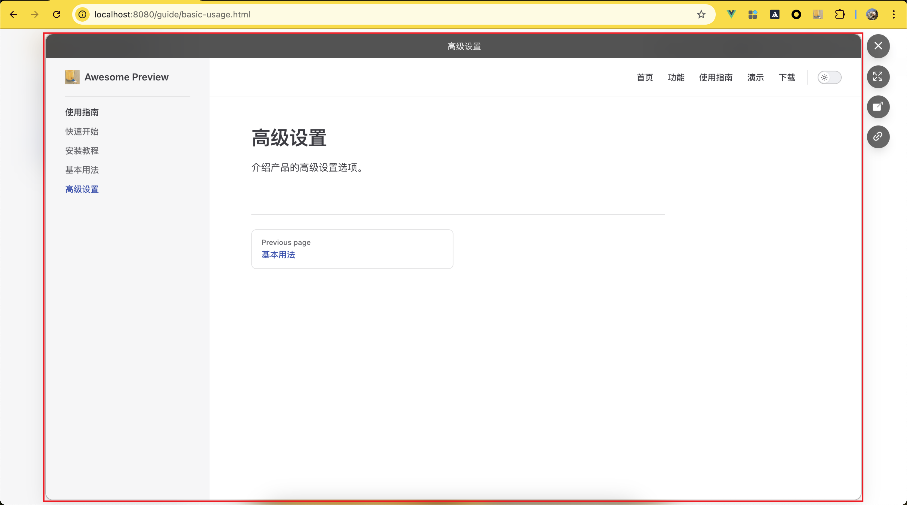

# 基本用法

## 预览链接

按住 `Shift` + `点击`链接

## 关闭

1. 第一种

  
  
点击关闭按钮，关闭预览窗口

2. 第二种

  
  
点击主面板意外的区域关闭预览窗口

3. 第三种
按下`Esc`关闭预览窗口

## 在当前标签页打开

  
  
点击按钮，在当前标签页打开预览窗口

## 新标签打开

  
  
点击这个按钮，在新的标签页打打开预览窗口

## 复制链接

  
  
点击这个按钮复制预览窗口的链接

