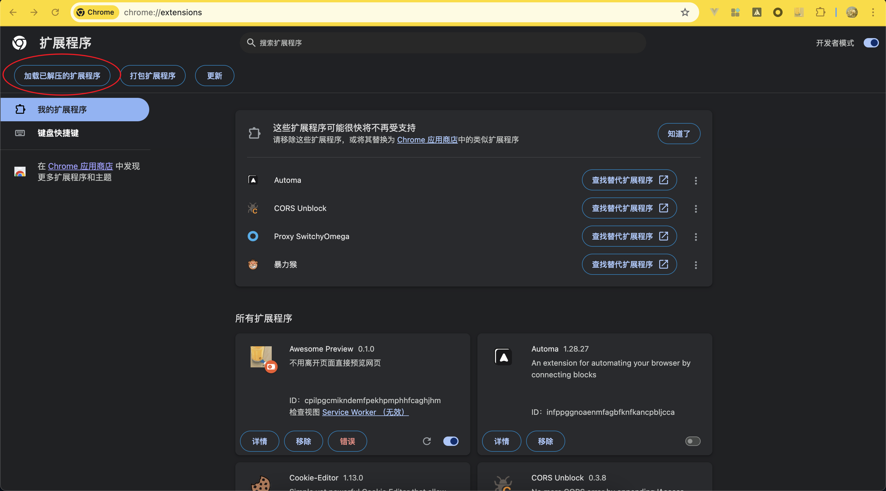
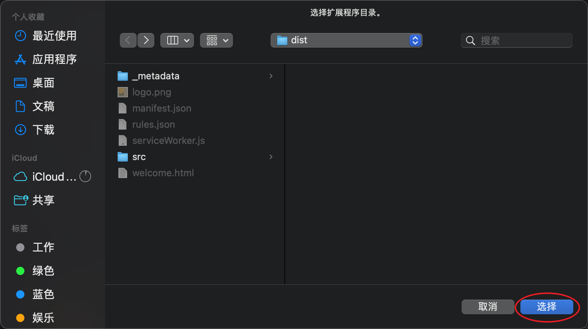

# 安装教程

> 首先打开你浏览器的扩展管理页面，一下使用 chrome 为例。

## 复制到浏览器打开

```txt
chrome://extensions
```

## 打开开发者模式
<div align="center">
  
</div>

## 加载插件
<div align="center">
  
</div>

## 选择目录
<div align="center">

</div>
